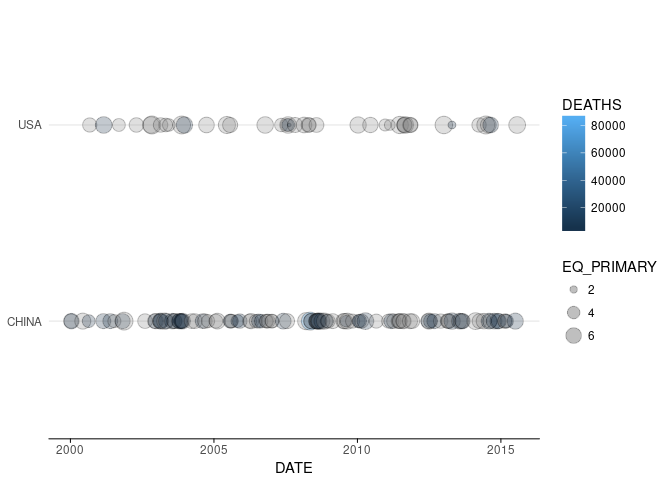
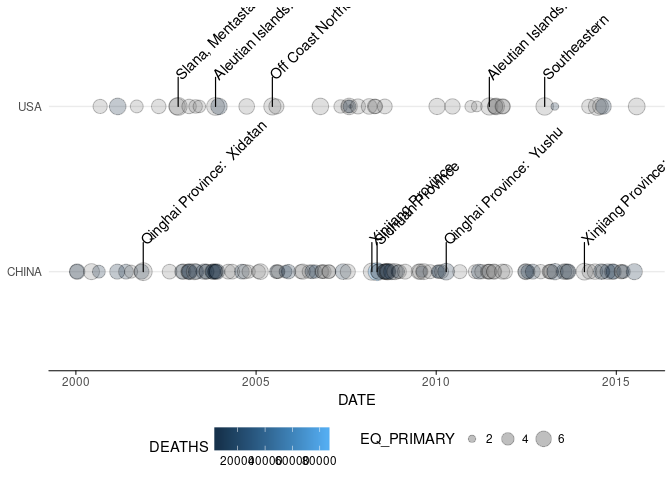
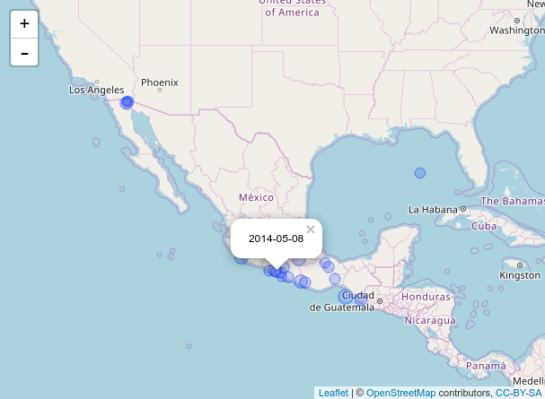
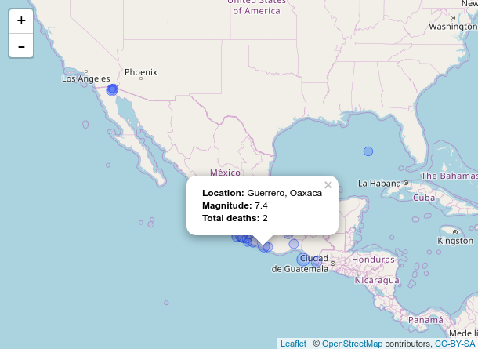
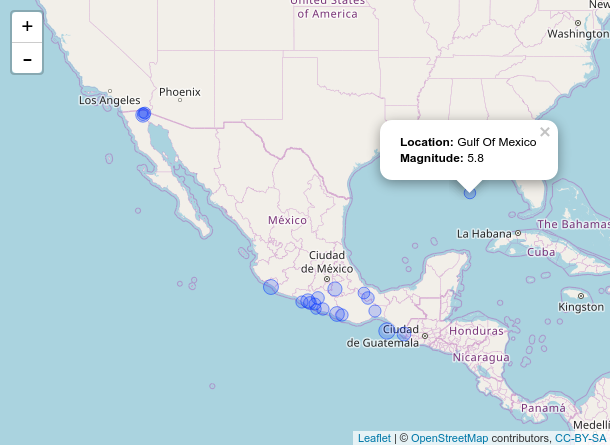

[](https://travis-ci.org/sophiasagan/R_Capstone)


## Capstone project - R software development

This project provides functions for the cleaning and visualization of the
NOOA Dataset. In particular, it provides:

- Functions for cleaning data, parsing strings, converting fields in the appropriate format
- Functions for visualizing data over time
- Functions for visualizing data over space

## NOOA Dataset info

This capstone project will be centered around a dataset obtained from the U.S. National Oceanographic and Atmospheric Administration (NOAA) on significant earthquakes around the world. This dataset contains information about 5,933 earthquakes over an approximately 4,000 year time span.

## Parsing data

`eq_clean_data` converts time information to Date class,
it converts the longitude and latitude information to numeric
and it applies the `eq_location_clean` function to LOCATION_NAME field.

```{r, eval=FALSE}
earthquakes <- capstone::eq_clean_data( readr::read_delim("signif.txt",delim="\t") )
```

## Visualization over time

`geom_timeline` visualizes the times at which earthquakes occur within
certain countries. In addition, it displays the magnitudes (i.e. Richter
scale value) and the number of deaths associated with each earthquake.
`geom_timeline_label` adds labels of the earthquakes on a Timeline representation.

```{r, eval=FALSE}
ggplot2::ggplot(data = to_plot) +
  ggplot2::geom_segment(ggplot2::aes(x = x, xend = xmax, y = COUNTRY, yend = COUNTRY),
               alpha = 0.5, color = "gray") +
  capstone::geom_timeline(ggplot2::aes(x = date, y = COUNTRY, i = INTENSITY, d = DEATHS)) +
  ggplot2::geom_segment(data = to_plot2, ggplot2::aes(x = date, xend = date, y = COUNTRY, yend = as.numeric(COUNTRY) + 0.25),
               alpha = 0.5, color = "gray") +
  capstone::geom_timeline_label(data = to_plot2, ggplot2::aes(x = date, y = as.numeric(COUNTRY) + 0.4, label = LOCATION_NAME)) +
  ggplot2::theme_minimal()
```

## Visualization over space

`eq_map` maps the epicenters (LATITUDE/LONGITUDE) and annotates
each point in a pop up window containing annotation data stored in a
column of the data frame.
`eq_create_label`creates an HTML label for the leaflet map
containing the location cleaned by the `eq_location_clean` function,
the magnitude (EQ_PRIMARY), and the total number of deaths (TOTAL_DEATHS).

```{r, eval=FALSE}
out <- capstone::eq_clean_data(out)
out <- dplyr::filter(out, COUNTRY == "MEXICO" & lubridate::year(date) >= 2000)
out <- dplyr::mutate(out, popup_text = capstone::eq_create_label(out))
capstone::eq_map(out, annot_col = "popup_text")
```

## Timeline geoms

In this package are available two geoms that can be used to plot
earthquake data.

The first geom, `geom_timeline()` is used for plotting a time line of
earthquakes ranging from xmin to xmax dates, with a point for each
earthquake. Optional aesthetics include color, size and alpha. The x
aesthetic is a date and an optional y aesthetic is a factor indicating
some stratification for multiple lines.

``` r
library(ggplot2)
library(lubridate)
clean %>%
  filter(COUNTRY %in% c('USA', 'CHINA')) %>%

  ggplot(aes(x = DATE, y = COUNTRY, size=EQ_PRIMARY, fill = DEATHS)) +
    geom_timeline(alpha = 0.25, xmin = ymd('2000-01-01'), xmax = ymd('2015-12-31')) +
    theme_minimal() + theme(panel.grid.minor.x = element_blank(),
                            panel.grid.major.x = element_blank(),
                            axis.line.y = element_blank(),
                            axis.title.y = element_blank(),
                            axis.line.x = element_line(),
                            axis.ticks.x = element_line())
```

<!-- -->

The second geom is called `geom_timeline_label()` and is used for adding
annotations to the earthquake data. This geom adds a vertical line to
each data point with a text annotation (e.g. the location of the
earthquake) attached to each line. There should be an option to subset
to n\_max number of earthquakes, where we take the n\_max largest (by
magnitude) earthquakes. Aesthetics are `x`, which is the date of the
earthquake and `label` which takes the column name from which
annotations will be obtained.

``` r

data <- clean %>%
  filter(COUNTRY %in% c('USA', 'CHINA'))

labels <- data %>%
  top_earthquakes(10, ymd('2000-01-01'), ymd('2015-12-31'))
 

  ggplot(data, aes(x = DATE, y = COUNTRY, fill = DEATHS)) +
    geom_timeline(aes(size = EQ_PRIMARY), alpha = 0.25, xmin = ymd('2000-01-01'), xmax = ymd('2015-12-31')) +
    geom_timeline_label(data = labels, mapping = aes(x = DATE, y = COUNTRY, label = LOCATION_NAME)) +
    theme_minimal() + theme(panel.grid.minor.x = element_blank(),
                            panel.grid.major.x = element_blank(),
                            axis.line.y = element_blank(),
                            axis.title.y = element_blank(),
                            axis.line.x = element_line(),
                            axis.ticks.x = element_line(),
                            legend.position = 'bottom')
```

<!-- -->

## Maps

There is a function called eq\_map() that takes an argument data
containing the filtered data frame with earthquakes to visualize. The
function maps the epicenters (LATITUDE/LONGITUDE) and annotates each
point with in pop up window containing annotation data stored in a
column of the data frame. The user should be able to choose which column
is used for the annotation in the pop-up with a function argument named
annot\_col. Each earthquake should be shown with a circle, and the
radius of the circle should be proportional to the earthquake’s
magnitude (EQ\_PRIMARY). One example of this function is:

``` r
clean %>%  
  filter(COUNTRY == "MEXICO" & year(DATE) >= 2000) %>% 
  eq_map(annot_col = "DATE")
```



In this case, the image is static, but it is a full interactive map in
R.

Finally a function called eq\_create\_label() is available, so that it
takes the dataset as an argument and creates an HTML label that can be
used as the annotation text in the leaflet map. This function puts
together a character string for each earthquake that will show the
cleaned location (as cleaned by the eq\_location\_clean() function
created in Module 1), the magnitude (EQ\_PRIMARY), and the total number
of deaths (TOTAL\_DEATHS), with boldface labels for each (“Location”,
“Total deaths”, and “Magnitude”). If an earthquake is missing values
for any of these, both the label and the value should be skipped for
that element of the tag. The resulting code is:

``` r
clean %>% 
  filter(COUNTRY == "MEXICO" & year(DATE) >= 2000) %>% 
  mutate(popup_text = eq_create_label(.)) %>% 
  eq_map(annot_col = "popup_text")
```




Again, the image is static, but it is a full interactive map in R.
